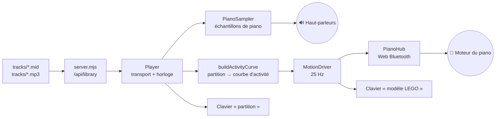

# 🎹 Jukebox — LEGO Ideas Grand Piano 21323

Un jukebox qui tourne dans le navigateur : tu choisis un morceau, le son sort des
haut-parleurs de l'ordinateur, et le piano LEGO fait bouger ses touches en rythme,
piloté en Bluetooth.

Aucune dépendance, aucune étape de compilation, aucun compte à créer :
un serveur Node de 250 lignes et une page web.

```
npm start          # puis ouvrir http://localhost:4173 dans Chrome ou Edge
```

---

## Sommaire

- [Ce que le piano sait faire (et ce qu'il ne sait pas faire)](#ce-que-le-piano-sait-faire-et-ce-quil-ne-sait-pas-faire)
- [Démarrage](#démarrage)
- [Ajouter de la musique : MIDI ou MP3 ?](#ajouter-de-la-musique--midi-ou-mp3-)
- [Comment ça marche](#comment-ça-marche)
- [Régler le mouvement des touches](#régler-le-mouvement-des-touches)
- [En cas de problème](#en-cas-de-problème)
- [Étape 2 — micrologiciel personnalisé](#étape-2--micrologiciel-personnalisé)
- [Crédits et licences](#crédits-et-licences)

---

## Ce que le piano sait faire (et ce qu'il ne sait pas faire)

Avant d'écrire une ligne de code, j'ai démonté le fonctionnement du modèle. C'est
la contrainte qui structure tout le projet, autant la poser tout de suite.

Le 21323 contient trois composants électroniques Powered Up :

| Élément | Rôle |
|---|---|
| **Hub 2 ports** (réf. 88009, pièce `bb0892c01`, 6 piles AAA) | cerveau et radio Bluetooth |
| **Moteur simple** (*Simple Medium Linear Motor*, sans encodeur) | entraîne l'arbre à cames |
| **Capteur de distance WeDo 2.0** | voit passer un drapeau quand une touche est enfoncée |

Derrière le clavier court **un unique axe Technic** garni de leviers, chacun calé
à un angle différent de ses voisins. Quand le moteur tourne, les leviers soulèvent
les touches les unes après les autres — c'est le principe d'un cylindre de boîte
à musique.

> **Conséquence directe : on ne peut pas commander une touche précise.**
> La seule grandeur pilotable est la *vitesse de rotation de l'arbre*. C'est vrai
> aussi de l'application officielle LEGO : elle ne fait pas mieux, elle module la
> vitesse du moteur pendant qu'elle joue le son sur le téléphone. Aucun
> micrologiciel ne changera cela — c'est de la mécanique, pas du logiciel.

Ce jukebox fait donc la même chose que l'application LEGO, en mieux : **il déduit
d'une vraie partition** l'intensité de chaque instant (densité des notes,
nuances, temps forts), et en tire une consigne moteur qui suit réellement la
musique — au lieu d'une boucle unique et invariable.

---

## Démarrage

### Prérequis

- **Node.js 18 ou plus** (`node --version`)
- **Chrome, Edge, Brave ou Arc.** Le Web Bluetooth n'existe ni sur Safari ni sur
  Firefox. La musique fonctionne partout ; c'est le pilotage du piano qui exige
  un navigateur compatible.
- **macOS** : la première connexion demande l'autorisation Bluetooth pour le
  navigateur. Si rien ne se passe, va dans *Réglages Système → Confidentialité et
  sécurité → Bluetooth* et active Chrome.

### Lancer

```bash
npm start
```

Puis ouvre **http://localhost:4173**.

> ⚠️ Utilise bien `localhost`. Le Web Bluetooth n'est accessible que depuis un
> « contexte sécurisé » : `https://` ou `localhost`. Un fichier ouvert en
> `file://`, ou l'adresse IP de la machine, ne fonctionnera pas.

Au tout premier lancement, si le dossier `tracks/` est vide, quatre morceaux de
démonstration y sont écrits (des œuvres du domaine public, générées localement,
rien n'est téléchargé).

### Connecter le piano

1. Mets 6 piles AAA dans le hub, à l'intérieur du piano.
2. **Appuie brièvement sur le bouton vert du hub** : il clignote en blanc, signe
   qu'il annonce sa présence.
3. Clique sur **« Connecter le piano »** dans la page, et choisis le hub dans la
   liste que propose le navigateur.

Ne l'apparie **pas** dans les réglages Bluetooth de macOS : le hub utilise le
Bluetooth basse consommation, et c'est le navigateur qui s'y connecte
directement. S'il est déjà pris par l'application LEGO Powered Up, ferme-la.

---

## Ajouter de la musique : MIDI ou MP3 ?

Dépose tes fichiers dans le dossier **`tracks/`**, puis clique sur *Actualiser*.

**Le MIDI est le format à privilégier**, et voici pourquoi : un fichier MIDI n'est
pas de l'audio, c'est une partition — chaque note, son instant, sa durée, sa
nuance. Le jukebox sait donc exactement ce qui se passe à chaque milliseconde et
peut caler le moteur au temps près. Un MP3 n'est qu'une onde : il faut deviner.

Les trois cas sont gérés :

| Ce que tu déposes | Son | Mouvement des touches |
|---|---|---|
| `Titre.mid` **(recommandé)** | synthétisé par le navigateur, avec des échantillons de vrai piano | calé sur la partition, au temps près |
| `Titre.mid` **+** `Titre.mp3` | ton fichier audio, tel quel | calé sur la partition |
| `Titre.mp3` seul | ton fichier audio | déduit en direct du niveau sonore — correct, mais moins précis |

### Nommage

Le nom du fichier fait office de fiche :

```
tracks/
├── Frédéric Chopin - Nocturne op.9 no.2.mid     → interprète + titre
├── Frédéric Chopin - Nocturne op.9 no.2.jpg     → pochette (facultative)
├── Scott Joplin - The Entertainer.mid
├── Scott Joplin - The Entertainer.mp3           → un vrai enregistrement
└── Une improvisation.mid                        → sans interprète, ça marche aussi
```

Les fichiers qui partagent le même nom de base forment **un seul morceau**.
Formats audio acceptés : `.mp3`, `.m4a`, `.ogg`, `.opus`, `.wav`, `.flac`.
Pochettes : `.jpg`, `.png`, `.webp`, `.avif`. Sans pochette, une couleur est
tirée du titre.

### Où trouver des MIDI

Le répertoire pour piano est immense et largement dans le domaine public :
[Mutopia](https://www.mutopiaproject.org/), les archives
[Piano-MIDI.de](http://www.piano-midi.de/), ou les partitions de
[MuseScore](https://musescore.org) exportées en MIDI. Un séquenceur (Logic,
Ableton, GarageBand, MuseScore) exporte aussi tes propres compositions.

### Écouter hors connexion

Par défaut, les échantillons de piano sont chargés depuis un CDN au premier
lancement (environ 2 Mo, ensuite mis en cache par le navigateur). Pour t'en
affranchir totalement :

```bash
npm run fetch-samples
```

Les fichiers atterrissent dans `web/assets/piano/` et le jukebox les préfère
automatiquement. Si tout échoue — pas de réseau, pas de copie locale — un
synthétiseur de secours intégré prend le relais : moins beau, mais toujours là.

---

## Comment ça marche



### Les fichiers

```
server.mjs                      Serveur statique + inventaire de tracks/ (aucune dépendance)
scripts/
  make-demo-tracks.mjs          Écrit un fichier MIDI standard à partir de partitions codées en dur
  fetch-samples.mjs             Copie les échantillons de piano en local
web/
  index.html  styles.css        L'interface
  js/
    main.js                     Assemblage : bibliothèque, lecteur, hub, interface
    ui.js                       Claviers, pochettes, notifications, journal
    lego/
      protocol.js               LEGO Wireless Protocol 3.0 — encodage des messages
      hub.js                    Connexion Web Bluetooth, découverte des ports, file d'écriture
    music/
      midi.js                   Lecteur de fichiers MIDI standard (formats 0 et 1), écrit à la main
      sampler.js                Échantillonneur + synthétiseur de repli + réverbération
      player.js                 Transport, ordonnancement des notes, horloge commune
      choreography.js           Courbe d'activité et pilote du moteur
```

### Le dialogue avec le hub

Le hub parle le [LEGO Wireless Protocol 3.0](https://lego.github.io/lego-ble-wireless-protocol-docs/),
publié par LEGO. Tout passe par une seule caractéristique BLE :

- service `00001623-1212-efde-1623-785feabcd123`
- caractéristique `00001624-1212-efde-1623-785feabcd123`

Un message vaut `[longueur, 0x00, type, …]`. Les trois qui nous intéressent :

| Intention | Octets |
|---|---|
| Puissance moteur | `08 00 81 <port> 10 51 00 <puissance>` |
| Écouter un capteur | `0A 00 41 <port> <mode> 01 00 00 00 01` |
| Couleur de la LED | `0A 00 81 32 10 51 01 <r> <g> <b>` |

Le code **ne suppose rien** du câblage : au moment de la connexion, le hub
annonce spontanément ce qui est branché sur chaque port (message *Hub Attached
I/O*), et `hub.js` en déduit lequel porte le moteur et lequel porte le capteur.
Si tu as inversé les prises, ça marche quand même.

Chrome n'autorise **qu'une écriture GATT à la fois** : `hub.js` sérialise donc les
envois dans une file, et les consignes moteur s'y **écrasent** au lieu de
s'empiler — seule la dernière part sur le lien, ce qui évite d'accumuler du
retard. Le débit est plafonné à 25 Hz.

### De la partition au mouvement

`choreography.js` échantillonne le morceau tous les 20 ms :

1. chaque **attaque de note** dépose une impulsion pondérée par sa nuance, qui
   décroît en ~260 ms ;
2. chaque **note tenue** entretient un fond continu ;
3. la courbe est normalisée sur son **90ᵉ centile**, pour qu'une berceuse fasse
   autant bouger le piano qu'un ragtime ;
4. à la lecture, la valeur est lue **en avance** (réglage *Avance*) pour
   compenser la latence Bluetooth et l'inertie du moteur ;
5. les **temps** de la grille rythmique ajoutent un coup d'accélérateur, plus
   marqué sur les temps forts ;
6. sous un seuil, le moteur est coupé — avec une hystérésis de 220 ms, sans quoi
   il hoqueterait sur chaque respiration de la musique.

Le pilote tourne sur son propre minuteur à 25 Hz, indépendant de l'affichage.
Comme l'onglet joue du son, Chrome ne ralentit pas ses minuteurs même en
arrière-plan — mais garde quand même la page visible pour un rendu impeccable.

### Deux claviers à l'écran

- **Partition** — les 88 touches d'un vrai piano ; s'allument les notes réellement
  jouées par le fichier.
- **Modèle LEGO** — 25 touches, animées par une simulation de l'arbre à cames
  (les phases des leviers sont réparties selon l'angle d'or, comme sur le modèle).
  C'est un aperçu fidèle de ce que fait le piano à cet instant, même sans hub
  connecté.

---

## Régler le mouvement des touches

Bouton ⚙︎ en haut à droite. Tous les réglages sont conservés d'une session à
l'autre, et prennent effet **immédiatement, en cours de lecture** — c'est fait
pour être réglé à l'oreille et à l'œil, piano en marche.

| Réglage | À quoi ça sert | Départ |
|---|---|---|
| **Puissance minimale** | seuil auquel l'arbre commence vraiment à tourner. Trop bas : le moteur bourdonne sans bouger et chauffe. | 40 |
| **Puissance maximale** | vitesse dans les passages les plus denses. | 90 |
| **Avance** | de combien la consigne précède le son. Si les touches semblent en retard, augmente. | 140 ms |
| **Accent sur les temps** | coup de fouet sur chaque temps. À 0, le mouvement suit seulement la densité. | 35 % |
| **Sensibilité** | plus c'est haut, plus les nuances douces font déjà bouger les touches. | 65 % |
| **Arrêter pendant les silences** | coupe franchement le moteur. | activé |
| **Faire pulser la LED** | la LED du hub suit l'intensité. | activé |
| **Inverser le sens** | si l'arbre force ou grince dans un sens. | désactivé |

**Trouver la bonne puissance minimale** : ouvre *Essai du moteur*, pousse le
curseur depuis 0 jusqu'à ce que les touches se mettent à bouger franchement.
C'est ta valeur — mets-la dans *Puissance minimale*.

Raccourcis clavier : `Espace` lecture/pause, `⇧←` / `⇧→` morceau précédent /
suivant, `Échap` ferme les réglages.

Pour mettre au point plus finement, `window.jukebox` expose `player`, `driver`,
`hub` et `settings` dans la console du navigateur.

---

## En cas de problème

**« Ce navigateur ne prend pas en charge le Web Bluetooth »**
Safari et Firefox n'implémentent pas cette API et ne prévoient pas de le faire.
Ouvre la page dans Chrome, Edge, Brave ou Arc.

**Le hub n'apparaît pas dans la liste du navigateur**
Le hub n'annonce sa présence que **quelques minutes** après un appui sur le bouton
vert, et seulement s'il clignote en blanc. Appuie à nouveau, puis relance la
recherche. Vérifie aussi que l'application LEGO Powered Up n'est pas connectée en
même temps : le hub n'accepte qu'un maître à la fois.

**Connecté, mais les touches ne bougent pas**
- Ouvre les réglages : *Piloter le moteur du piano* doit être coché.
- Le *Journal*, en bas du tiroir, indique le port et le type du moteur détecté.
  S'il n'y a rien, la fiche du moteur est mal enfoncée dans le hub.
- Monte *Puissance minimale*. Sous ~30, le moteur ne vainc pas la charge de
  l'arbre à cames — surtout avec des piles fatiguées.
- Des piles faibles se voient au pourcentage affiché à côté du nom du hub.

**Le son est là, le mouvement décalé**
Augmente *Avance*. 140 ms convient à la plupart des machines ; une liaison
Bluetooth encombrée peut demander 250 ms ou plus.

**« GATT operation already in progress » dans la console**
Sans effet : les écritures sont mises en file et rejouées. Si cela se répète en
boucle, la liaison est probablement saturée — rapproche l'ordinateur du piano.

**Le moteur tourne encore alors que j'ai fermé l'onglet**
La page envoie une consigne d'arrêt en se fermant, mais si la fermeture est
brutale le hub peut conserver sa dernière consigne. **Appui long sur le bouton
vert : le hub s'éteint.** C'est l'arrêt d'urgence, toujours disponible.

**La lecture s'arrête quand je change d'onglet**
Non : le son continue. En revanche, si l'onglet est masqué *et* muet, Chrome
ralentit les minuteurs et le mouvement peut se figer. Le moteur est coupé à la
fermeture de la page, quoi qu'il arrive.

**Le dossier `tracks/` a changé mais pas la liste**
Le serveur relit le dossier à chaque appel : clique sur *Actualiser*.

---

## Étape 2 — micrologiciel personnalisé

C'est possible, c'est **réversible**, et c'est documenté en détail dans
**[`docs/firmware.md`](docs/firmware.md)** : ce qu'un micrologiciel Pybricks
apporterait, ce qu'il n'apportera jamais (les touches indépendantes, non), la
procédure d'installation, et surtout **la procédure de retour au micrologiciel
officiel LEGO**.

Résumé honnête : le remplacement du micrologiciel ne change rien à la mécanique.
Son seul intérêt réel serait de faire tourner la chorégraphie *dans le hub*, pour
que le piano joue sans ordinateur. Pour ce jukebox, ça n'apporte rien — et ça
coûte l'incompatibilité avec l'application LEGO tant que le micrologiciel
d'origine n'est pas restauré. À lire avant de se lancer.

---

## Crédits et licences

- **Protocole** — [LEGO Wireless Protocol 3.0](https://lego.github.io/lego-ble-wireless-protocol-docs/),
  publié par LEGO System A/S. Les détails d'implémentation (encodage des
  commandes moteur, cartographie des ports du hub 2 ports) ont été recoupés avec
  [node-poweredup](https://github.com/nathankellenicki/node-poweredup) et
  [pybricksdev](https://github.com/pybricks/pybricksdev), tous deux sous licence MIT.
- **Échantillons de piano** — [Salamander Grand Piano](https://archive.org/details/SalamanderGrandPianoV3)
  d'Alexander Holm, licence Creative Commons BY 3.0, servi par le projet Tone.js.
- **Morceaux de démonstration** — œuvres du domaine public (Bach, Beethoven), dont
  les données MIDI ont été saisies pour ce dépôt.
- Ce projet n'est ni affilié ni approuvé par le groupe LEGO. LEGO® est une marque
  déposée du groupe LEGO.
- Code sous licence MIT.
