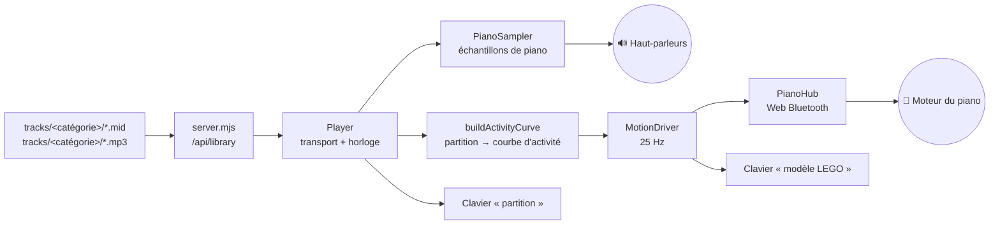

# 🎹 Jukebox — LEGO Ideas Grand Piano 21323

Un jukebox qui tourne dans le navigateur : tu choisis un morceau, le son sort des
haut-parleurs de l'ordinateur, et le piano LEGO fait bouger ses touches en rythme,
piloté en Bluetooth.

Aucune dépendance, aucune étape de compilation, aucun compte à créer :
un serveur Node de 250 lignes et une page web.

```
npm start          # puis ouvrir http://localhost:4173 dans Chrome ou Edge
```

> 📖 **Première fois ?** Le [**guide pas à pas**](docs/guide.md) décrit chaque
> geste, sur le piano comme sur l'ordinateur, et ce que tu dois voir à chaque
> étape. Ce README-ci explique plutôt *comment ça marche*.
>
> Les deux se lisent **directement dans l'application** : bouton 📖 en haut à
> droite, ou touche <kbd>?</kbd>. Pas besoin d'aller chercher un fichier.

---

## Sommaire

- [**Guide pas à pas** — connecter le piano et se servir de l'application](docs/guide.md)
- [Ce que le piano sait faire (et ce qu'il ne sait pas faire)](#ce-que-le-piano-sait-faire-et-ce-quil-ne-sait-pas-faire)
- [Démarrage](#démarrage)
- [Ajouter de la musique : MIDI ou MP3 ?](#ajouter-de-la-musique--midi-ou-mp3-)
- [Comment ça marche](#comment-ça-marche)
- [Thèmes](#thèmes)
- [Geek mode](#geek-mode)
- [Mise en route](#mise-en-route)
- [Régler le mouvement des touches](#régler-le-mouvement-des-touches)
- [Le panneau matériel](#le-panneau-matériel)
- [En cas de problème](#en-cas-de-problème)
- [Étape 2 — micrologiciel personnalisé](#étape-2--micrologiciel-personnalisé)
- [Crédits et licences](#crédits-et-licences)

---

## Ce que le piano sait faire (et ce qu'il ne sait pas faire)

Avant d'écrire une ligne de code, j'ai démonté le fonctionnement du modèle. C'est
la contrainte qui structure tout le projet, autant la poser tout de suite.

Le 21323 contient trois composants électroniques Powered Up :

| Élément | Rôle |
|---|---|
| **Hub 2 ports** (réf. 88009, pièce `bb0892c01`, 6 piles AAA) | cerveau et radio Bluetooth |
| **Moteur simple** (*Simple Medium Linear Motor*, sans encodeur) | entraîne l'arbre à cames |
| **Capteur de distance WeDo 2.0** | voit passer un drapeau quand une touche est enfoncée |

Derrière le clavier court **un unique axe Technic** garni de leviers, chacun calé
à un angle différent de ses voisins. Quand le moteur tourne, les leviers soulèvent
les touches les unes après les autres — c'est le principe d'un cylindre de boîte
à musique.

> **Conséquence directe : on ne peut pas commander une touche précise.**
> La seule grandeur pilotable est la *vitesse de rotation de l'arbre*. C'est vrai
> aussi de l'application officielle LEGO : elle ne fait pas mieux, elle module la
> vitesse du moteur pendant qu'elle joue le son sur le téléphone. Aucun
> micrologiciel ne changera cela — c'est de la mécanique, pas du logiciel.

Ce jukebox fait donc la même chose que l'application LEGO, en mieux : **il déduit
d'une vraie partition** l'intensité de chaque instant (densité des notes,
nuances, temps forts), et en tire une consigne moteur qui suit réellement la
musique — au lieu d'une boucle unique et invariable.

---

## Démarrage

### Prérequis

- **Node.js 18 ou plus** (`node --version`)
- **Chrome, Edge, Brave ou Arc.** Le Web Bluetooth n'existe ni sur Safari ni sur
  Firefox. La musique fonctionne partout ; c'est le pilotage du piano qui exige
  un navigateur compatible.
- **macOS** : la première connexion demande l'autorisation Bluetooth pour le
  navigateur. Si rien ne se passe, va dans *Réglages Système → Confidentialité et
  sécurité → Bluetooth* et active Chrome.

### Lancer

```bash
npm start
```

Puis ouvre **http://localhost:4173**.

> ⚠️ Utilise bien `localhost`. Le Web Bluetooth n'est accessible que depuis un
> « contexte sécurisé » : `https://` ou `localhost`. Un fichier ouvert en
> `file://`, ou l'adresse IP de la machine, ne fonctionnera pas.

Au tout premier lancement, si le dossier `tracks/` est vide, une bibliothèque de
départ y est écrite : 31 morceaux répartis en quatre catégories, générés
localement note à note — rien n'est téléchargé.

### Connecter le piano

*Version détaillée, avec ce que tu dois voir à chaque étape :
[guide pas à pas](docs/guide.md#étape-4--connecter-le-piano).*

1. Mets 6 piles AAA dans le hub, à l'intérieur du piano.
2. **Appuie brièvement sur le bouton vert du hub** : il clignote en blanc, signe
   qu'il annonce sa présence.
3. Clique sur **« Connecter le piano »** dans la page, et choisis le hub dans la
   liste que propose le navigateur.

Ne l'apparie **pas** dans les réglages Bluetooth de macOS : le hub utilise le
Bluetooth basse consommation, et c'est le navigateur qui s'y connecte
directement. S'il est déjà pris par l'application LEGO Powered Up, ferme-la.

---

## Ajouter de la musique : MIDI ou MP3 ?

Dépose tes fichiers dans le dossier **`tracks/`**, puis clique sur *Actualiser*.

### Les catégories

Chaque **sous-dossier de `tracks/` est une catégorie**, qui s'affiche dans la
page sous la forme d'une section qu'on ouvre et qu'on ferme d'un clic. Un
sous-dossier vide reste visible : c'est ainsi qu'on sait où déposer ses
fichiers. Les fichiers laissés à la racine forment la catégorie
*Mes morceaux*. Un seul niveau est exploré — un dossier dans un dossier est
ignoré.

| Catégorie | Contenu |
|---|---|
| `Classique/` | 20 pièces du domaine public, en arrangement simplifié |
| `Moderne/` | 10 pièces originales, dans les esthétiques actuelles |
| `Gaming/` | vide — à remplir |
| `Réglage/` | la piste de calibration du moteur |

L'ordre d'affichage de ces quatre catégories est fixé dans `server.mjs`
(`CATEGORY_ORDER`) ; toute autre catégorie vient ensuite, par ordre
alphabétique. L'état ouvert/fermé de chacune est retenu d'une visite à l'autre.

Pour régénérer la bibliothèque de départ sans repartir d'un dossier vide :

```bash
npm run make-library
```

Un fichier déjà présent n'est jamais écrasé ; ajoute `-- --force` pour le
réécrire quand même.

**Le MIDI est le format à privilégier**, et voici pourquoi : un fichier MIDI n'est
pas de l'audio, c'est une partition — chaque note, son instant, sa durée, sa
nuance. Le jukebox sait donc exactement ce qui se passe à chaque milliseconde et
peut caler le moteur au temps près. Un MP3 n'est qu'une onde : il faut deviner.

Les trois cas sont gérés :

| Ce que tu déposes | Son | Mouvement des touches |
|---|---|---|
| `Titre.mid` **(recommandé)** | synthétisé par le navigateur, avec des échantillons de vrai piano | calé sur la partition, au temps près |
| `Titre.mid` **+** `Titre.mp3` | ton fichier audio, tel quel | calé sur la partition |
| `Titre.mp3` seul | ton fichier audio | déduit en direct du niveau sonore — correct, mais moins précis |

### Nommage

Le nom du fichier fait office de fiche :

```
tracks/
├── Classique/
│   ├── Frédéric Chopin - Nocturne op.9 no.2.mid → interprète + titre
│   ├── Frédéric Chopin - Nocturne op.9 no.2.jpg → pochette (facultative)
│   ├── Scott Joplin - The Entertainer.mid
│   └── Scott Joplin - The Entertainer.mp3       → un vrai enregistrement
├── Gaming/                                      → catégorie vide, mais visible
└── Une improvisation.mid                        → à la racine, sans interprète
```

Les fichiers qui partagent le même nom de base forment **un seul morceau**.
Formats audio acceptés : `.mp3`, `.m4a`, `.ogg`, `.opus`, `.wav`, `.flac`.
Pochettes : `.jpg`, `.png`, `.webp`, `.avif`. Sans pochette, une couleur est
tirée du titre.

### Où trouver des MIDI

Le répertoire pour piano est immense et largement dans le domaine public :
[Mutopia](https://www.mutopiaproject.org/), les archives
[Piano-MIDI.de](http://www.piano-midi.de/), ou les partitions de
[MuseScore](https://musescore.org) exportées en MIDI. Un séquenceur (Logic,
Ableton, GarageBand, MuseScore) exporte aussi tes propres compositions.

### Écouter hors connexion

Par défaut, les échantillons de piano sont chargés depuis un CDN au premier
lancement (environ 2 Mo, ensuite mis en cache par le navigateur). Pour t'en
affranchir totalement :

```bash
npm run fetch-samples
```

Les fichiers atterrissent dans `web/assets/piano/` et le jukebox les préfère
automatiquement. Si tout échoue — pas de réseau, pas de copie locale — un
synthétiseur de secours intégré prend le relais : moins beau, mais toujours là.

---

## Comment ça marche



### Les fichiers

```
server.mjs                      Serveur statique + inventaire de tracks/ (aucune dépendance)
scripts/
  midi-writer.mjs               Écrit un fichier MIDI standard et la grammaire des partitions
  make-library.mjs              Écrit la bibliothèque de départ dans tracks/, rangée par catégories
  scores/classique.mjs          Vingt pièces du domaine public, en arrangement simplifié
  scores/moderne.mjs            Dix pièces originales, dans les esthétiques actuelles
  fetch-samples.mjs             Copie les échantillons de piano en local
  test-protocol.mjs             Vérifie la couche protocole contre la spécification (npm test)
  test-markdown.mjs             Vérifie le convertisseur Markdown (npm test)
web/
  index.html  styles.css        L'interface (styles.css porte les thèmes)
  geek.html                     Page du second écran : la télémétrie seule, plein écran
  assets/
    brand/                      Logo Epitech et polices de la charte (Anton, IBM Plex Sans)
  js/
    main.js                     Assemblage : bibliothèque, lecteur, hub, interface
    ui.js                       Claviers, pochettes, notifications, journal
    hubtools.js                 Panneaux matériel : infos, essais, capteur, console LWP3
    reader.js                   Lecteur de documentation intégré (bouton 📖)
    markdown.js                 Convertisseur Markdown → HTML, écrit à la main
    geek.js                     Panneau de télémétrie temps réel (« Geek mode »)
    geek-screen.js              Amorçage de la page du second écran
    lego/
      protocol.js               LEGO Wireless Protocol 3.0 — encodage et décodage complets
      hub.js                    Connexion Web Bluetooth, découverte des ports, file d'écriture
    music/
      midi.js                   Lecteur de fichiers MIDI standard (formats 0 et 1), écrit à la main
      sampler.js                Échantillonneur + synthétiseur de repli + réverbération
      player.js                 Transport, ordonnancement des notes, horloge commune
      choreography.js           Courbe d'activité et pilote du moteur
```

### Le dialogue avec le hub

Le hub parle le [LEGO Wireless Protocol 3.0](https://lego.github.io/lego-ble-wireless-protocol-docs/),
publié par LEGO. Tout passe par une seule caractéristique BLE :

- service `00001623-1212-efde-1623-785feabcd123`
- caractéristique `00001624-1212-efde-1623-785feabcd123`

Un message vaut `[longueur, 0x00, type, …]`. Voici ceux que le projet émet :

| Intention | Octets |
|---|---|
| Puissance moteur | `08 00 81 <port> 10 51 00 <puissance>` |
| Freinage actif | `08 00 81 <port> 11 51 00 7F` |
| Écouter un capteur | `0A 00 41 <port> <mode> 01 00 00 00 01` |
| Couleur de la LED | `0A 00 81 32 10 51 01 <r> <g> <b>` |
| Lire une propriété | `05 00 01 <propriété> 05` |
| Renommer le hub | `0A 00 01 01 01 <ascii>` |
| S'abonner à une alerte | `05 00 03 <alerte> 01` |
| Interroger un port | `05 00 21 <port> 01` |
| Détailler un mode | `06 00 22 <port> <mode> <info>` |
| Lecture combinée | `05 00 42 <port> 02` puis `06 00 42 <port> 01 <mode·jeu>` |
| Éteindre le hub | `04 00 02 01` |

Dans l'autre sens, `protocol.js` **décode tout** : les 24 types de messages, les
15 propriétés du hub, les alertes, les codes d'erreur, les accusés de réception,
les capacités des ports et le détail de leurs modes. C'est ce qui alimente la
console (voir plus bas). `npm test` vérifie cet encodage octet par octet contre
la spécification LEGO, sans matériel.

Le code **ne suppose rien** du câblage : au moment de la connexion, le hub
annonce spontanément ce qui est branché sur chaque port (message *Hub Attached
I/O*), et `hub.js` en déduit lequel porte le moteur et lequel porte le capteur.
Si tu as inversé les prises, ça marche quand même.

Chrome n'autorise **qu'une écriture GATT à la fois** : `hub.js` sérialise donc les
envois dans une file, et les consignes moteur s'y **écrasent** au lieu de
s'empiler — seule la dernière part sur le lien, ce qui évite d'accumuler du
retard. Le débit est plafonné à 25 Hz.

### De la partition au mouvement

`choreography.js` échantillonne le morceau tous les 20 ms :

1. chaque **attaque de note** dépose une impulsion pondérée par sa nuance, qui
   décroît en ~260 ms ;
2. chaque **note tenue** entretient un fond continu ;
3. la courbe est normalisée sur son **90ᵉ centile**, pour qu'une berceuse fasse
   autant bouger le piano qu'un ragtime ;
4. à la lecture, la valeur est lue **en avance** (réglage *Avance*) pour
   compenser la latence Bluetooth et l'inertie du moteur ;
5. les **temps** de la grille rythmique ajoutent un coup d'accélérateur, plus
   marqué sur les temps forts ;
6. sous un seuil, le moteur est coupé — avec une hystérésis de 220 ms, sans quoi
   il hoqueterait sur chaque respiration de la musique.

Le pilote tourne sur son propre minuteur à 25 Hz, indépendant de l'affichage.
Comme l'onglet joue du son, Chrome ne ralentit pas ses minuteurs même en
arrière-plan — mais garde quand même la page visible pour un rendu impeccable.

### Deux claviers à l'écran

- **Partition** — les 88 touches d'un vrai piano ; s'allument les notes réellement
  jouées par le fichier.
- **Modèle LEGO** — 25 touches, animées par une simulation de l'arbre à cames
  (les phases des leviers sont réparties selon l'angle d'or, comme sur le modèle).
  C'est un aperçu fidèle de ce que fait le piano à cet instant, même sans hub
  connecté.

---

## Thèmes

Trois habillages, au choix dans le tiroir de réglages (⚙︎ → **Apparence**) ; le
choix est conservé d'une session à l'autre.

- **Piano** — l'habillage par défaut : bois sombre, laiton, touches ivoire.
- **Epitech** — la charte graphique de l'école : bleu Epitech `#013afb`, fond
  clair posé sur le neutre *Drift*, triptyque *Tech* / *Together* / *Tomorrow*
  pour les états, titres en **Anton** et texte en **IBM Plex Sans**. Les angles
  sont francs, la grille « blueprint » remplace le grain, et l'underscore
  ponctue les titres, comme dans la charte.
- **LEGO** — l'interface montée en briques. Le fond est une plaque de base
  semée de tenons, un bandeau rouge / orange / jaune / vert / bleu court sous la
  barre supérieure, les panneaux sont coiffés d'une rangée de tenons, les boutons
  ont l'arête franche du plastique moulé et s'écrasent à l'appui, chaque morceau
  de la bibliothèque porte sa brique numérotée et la jauge du moteur est une
  rangée de briques 1×1 qui chauffe du vert au rouge. Surtout, **chacun des douze
  demi-tons a sa couleur de brique** : une gamme chromatique dessine un
  arc-en-ciel sur le clavier, du rouge pour le *do* au magenta pour le *si*.
  Aucune marque n'est reproduite : seulement la palette et la matière du
  plastique.

Techniquement, toute la couleur de `web/styles.css` passe par des variables CSS.
Un thème est donc un simple bloc `[data-theme="…"]` qui les redéfinit ;
l'attribut est posé sur `<html>` par un court script dans le `<head>`, avant le
premier rendu, pour éviter que la page clignote au chargement.

Les polices et le logo sont servis depuis `web/assets/brand/` : rien n'est
téléchargé à l'exécution, l'application reste utilisable hors connexion.

---

## Geek mode

Un interrupteur dans le tiroir de réglages (⚙︎ → **Démonstration**), ou la touche
<kbd>G</kbd>. Il ouvre en bas de l'écran un bandeau de télémétrie qui montre ce
qui se passe sous l'interface — pensé pour les journées portes ouvertes, où la
question « mais concrètement, il y a quoi derrière ? » revient à chaque visite.

Six cartes, plus le flux Bluetooth brut :

| Carte | Ce qu'on y voit |
| --- | --- |
| **Chaîne audio · DSP** | Spectre FFT et oscilloscope de la forme d'onde, fréquence d'échantillonnage, taille de fenêtre et résolution spectrale, latence matérielle (`baseLatency` + `outputLatency`), niveau RMS et crête en dBFS, centroïde spectral, réduction du limiteur, polyphonie |
| **Ordonnanceur · partition** | Courbe des notes en train de sonner, horloge de référence, position au milliseconde, fenêtre d'anticipation, cycles d'ordonnancement, notes programmées et manquées, dérive entre l'horloge audio et celle du système, tempo, mesure et temps en cours, densité de notes |
| **Chorégraphie · moteur** | Activité normalisée, accent, consigne PWM, plage de puissance, avance appliquée face à la **latence réellement mesurée** (audio + BLE), cadence et gigue du minuteur, vitesse estimée de l'arbre à cames, profil de démarrage (rampe / freinage), mode du capteur et sa lecture |
| **Liaison Bluetooth LE** | Service GATT, micrologiciel et version du protocole, RSSI, trames émises et reçues, débit, latence d'écriture GATT, profondeur de la file, accusés de réception attendus, reconnexions automatiques |
| **Alimentation · alertes** | Tension et courant mesurés par le hub, superposés sur un même cadre, puissance appelée, charge et type de piles, et les quatre alertes du protocole (tension basse, courant élevé, signal faible, surpuissance) qui passent en rouge quand elles se déclenchent |
| **Rendu · machine** | Images par seconde, temps par image (moyenne et p95), images longues, tas JavaScript, cœurs logiques, mémoire, zone d'affichage |
| **Flux Bluetooth brut** | Chaque message échangé avec le hub, en hexadécimal, suivi de sa traduction selon le LEGO Wireless Protocol 3.0 |

La carte **Alimentation** est la plus parlante quand le piano est branché : le
courant grimpe à chaque fois que l'arbre à cames force, et la tension s'affaisse
en retour. C'est la mécanique du modèle, lue à travers le Bluetooth.

Tout y est **mesuré**, jamais simulé : chaque valeur vient d'une API du
navigateur (Web Audio, Web Bluetooth, Performance) ou d'un compteur incrémenté
dans le code. La seule grandeur déduite d'un modèle — la vitesse de l'arbre à
cames — est annoncée comme une estimation.

### Le second écran

Une case à cocher séparée — ⚙︎ → **Démonstration → Second écran** — ouvre la
télémétrie dans un onglet à part, mise en page pour occuper tout un moniteur :
six cartes en deux rangées, texte agrandi pour être lisible de loin, le flux
Bluetooth sur toute la largeur, et un rappel du morceau en cours puisque le
jukebox est resté sur l'autre écran. Un bouton **Plein écran** y bascule la
fenêtre en plein écran véritable.

L'onglet déporté ne mesure rien lui-même : il ne peut pas. Un `AudioContext` ne
se partage pas entre fenêtres, et un hub Bluetooth n'accepte qu'une connexion
GATT à la fois. C'est donc la fenêtre du jukebox qui construit le panneau
*dans le document de l'autre* — ce que les navigateurs autorisent entre fenêtres
de même origine, via `window.opener`. Le code de rendu est le même que celui du
bandeau intégré : les deux vues ne peuvent pas diverger.

Deux boucles d'affichage l'animent, celle du jukebox et celle du second écran,
parce qu'un navigateur gèle `requestAnimationFrame` dans une fenêtre masquée :
si l'une des deux passe derrière, l'autre prend le relais. Le panneau se limite
lui-même à environ 70 rafraîchissements par seconde, les deux boucles ne se
cumulent donc pas.

L'option est **désactivée par défaut** et ne se rouvre pas toute seule au
rechargement : les navigateurs n'ouvrent une fenêtre qu'à la suite d'un clic.
Si l'onglet est fermé à la main, la case se décoche d'elle-même.

Le panneau coûte environ **0,13 ms par image** quand il est ouvert — 0,8 % du
budget d'une image à 60 Hz — et rien du tout quand il est fermé : la boucle de
rafraîchissement sort à sa première ligne. Les courbes sont redessinées à chaque
image, les quelque soixante valeurs chiffrées seulement dix fois par seconde.

---

## Mise en route

Une option facultative, dans le tiroir de réglages (⚙︎ → **Mise en route**),
désactivée au départ. Une fois cochée, un chef d'orchestre entre à l'écran
avant chaque morceau et demande au piano « Est-ce que tu es prêt ? ». Le piano
répond en faisant sonner quelques touches — un arpège de do majeur puis un
accord —, le chef écoute, puis donne le départ : « Alors, c'est parti ! », et
la musique démarre.

La réponse sort des haut-parleurs de l'ordinateur, connecté ou non : c'est lui
qui joue, ici comme pendant un morceau. Quand le hub est là, l'arbre à cames
tourne en plus au rythme de l'arpège, avec les mêmes puissances minimale et
maximale que le reste. Sans hub, seul le clavier « modèle LEGO » à l'écran
bouge — la scène est identique.

Un clic n'importe où passe l'introduction et lance la musique tout de suite ;
`Échap` l'annule sans rien jouer.

---

## Régler le mouvement des touches

Bouton ⚙︎ en haut à droite. Tous les réglages sont conservés d'une session à
l'autre, et prennent effet **immédiatement, en cours de lecture** — c'est fait
pour être réglé à l'oreille et à l'œil, piano en marche.

| Réglage | À quoi ça sert | Départ |
|---|---|---|
| **Puissance minimale** | seuil auquel l'arbre commence vraiment à tourner. Trop bas : le moteur bourdonne sans bouger et chauffe. | 40 |
| **Puissance maximale** | vitesse dans les passages les plus denses. | 90 |
| **Avance** | de combien la consigne précède le son. Si les touches semblent en retard, augmente. | 140 ms |
| **Accent sur les temps** | coup de fouet sur chaque temps. À 0, le mouvement suit seulement la densité. | 35 % |
| **Sensibilité** | plus c'est haut, plus les nuances douces font déjà bouger les touches. | 65 % |
| **Arrêter pendant les silences** | coupe franchement le moteur. | activé |
| **Freiner en fin de morceau** | freinage actif plutôt que roue libre : l'arbre s'arrête net. | activé |
| **Démarrage progressif** | une rampe de 0,4 s au lancement, pour éviter l'à-coup. | activé |
| **Faire pulser la LED** | la LED du hub suit l'intensité. | activé |
| **Inverser le sens** | si l'arbre force ou grince dans un sens. | désactivé |

**Trouver la bonne puissance minimale** : ouvre *Essai du moteur*, pousse le
curseur depuis 0 jusqu'à ce que les touches se mettent à bouger franchement.
C'est ta valeur — mets-la dans *Puissance minimale*.

Raccourcis clavier : `Espace` lecture/pause, `⇧←` / `⇧→` morceau précédent /
suivant, `Échap` ferme les réglages.

Pour mettre au point plus finement, `window.jukebox` expose `player`, `driver`,
`hub` et `settings` dans la console du navigateur.

---

## Le panneau matériel

Le tiroir de réglages contient, sous les commandes de chorégraphie, tout ce que
le hub sait faire d'autre. Rien n'est indispensable pour écouter de la musique —
c'est là pour régler, diagnostiquer et comprendre.

### Essai du moteur

Un curseur de puissance, plus quatre commandes :

- **Roue libre** — coupe l'alimentation, l'arbre finit sur son élan.
- **Freiner** — freinage actif : l'arbre s'arrête net. Le hub confirme
  l'exécution, et le résultat s'affiche sous les boutons.
- **Rampe 0 → max** — monte en régime sur deux secondes, pour voir si le
  démarrage est franc ou si le moteur peine.
- **Séquence d'essai** — enchaîne démarrage doux, palier lent, silence, palier
  rapide et arrêt : de quoi juger d'un coup d'œil si tes réglages tiennent.

Lancer un essai met la lecture en pause : les deux ne peuvent pas se disputer la
consigne moteur.

### Le hub

Tout ce que la brique sait dire d'elle-même : nom, versions du micrologiciel et
du matériel, fabricant, version du protocole, adresse MAC, type de piles, charge
et puissance du signal. On peut aussi :

- **la renommer** (14 caractères, gardés dans sa mémoire — le nouveau nom
  apparaîtra aussi dans l'application LEGO) ;
- **l'éteindre à distance** — il faudra rappuyer sur le bouton vert ;
- **se reconnecter tout seul**. Si la liaison tombe, le projet réessaie six fois
  avec un délai croissant, jusqu'à douze tentatives. Et au chargement de la page,
  si le navigateur a gardé l'autorisation d'un hub déjà utilisé, la liaison se
  rétablit sans repasser par le sélecteur.

Quatre pastilles suivent les **alertes matérielles** du hub : tension basse,
courant élevé, signal faible, surpuissance. Elles passent au rouge quand le hub
les déclenche, et une notification s'affiche.

### Capteur de touche

Le capteur de distance a deux modes, et on peut basculer de l'un à l'autre :

- **Distance** — 0 (touche enfoncée, drapeau collé au capteur) à 10 (rien devant) ;
- **Comptage** — le nombre de passages depuis l'allumage du hub. Utile pour
  savoir combien de fois les touches ont bougé pendant un morceau.

Un bouton tente en plus la **lecture combinée** des deux modes dans une même
notification. C'est expérimental : tous les capteurs ne l'acceptent pas, et la
réponse du hub s'affiche dans la console.

Enfin, un repli : si le hub n'annonce pas un port — fiche mal enfoncée, appareil
qu'il ne reconnaît pas — on peut **déclarer l'appareil à la main**.

### Alimentation

La tension et le courant mesurés à l'intérieur du hub. Le courant grimpe quand le
moteur force ; une tension qui s'effondre sous charge annonce des piles en fin de
vie bien avant que le pourcentage de batterie ne le dise.

### Console LWP3

Toutes les trames échangées avec le piano, en hexadécimal **et décodées en
clair**. Une case masque le flux continu du moteur, qui sinon noie tout le reste
à 25 trames par seconde.

Trois raccourcis : *Interroger les ports* demande à chaque port ses capacités,
*Explorer les modes* déroule le nom, l'unité et les bornes de chaque mode du
capteur, et le champ de saisie envoie une trame brute — le premier octet est la
longueur totale. Par exemple, `08 00 81 00 10 51 00 32` fait tourner le moteur du
port A à 50 %.

C'est l'équivalent, dans le navigateur, de ce que `pybricksdev` offre en ligne de
commande : de quoi explorer le protocole sans rien installer.

---

## En cas de problème

**« Ce navigateur ne prend pas en charge le Web Bluetooth »**
Safari et Firefox n'implémentent pas cette API et ne prévoient pas de le faire.
Ouvre la page dans Chrome, Edge, Brave ou Arc.

**Le hub n'apparaît pas dans la liste du navigateur**
Le hub n'annonce sa présence que **quelques minutes** après un appui sur le bouton
vert, et seulement s'il clignote en blanc. Appuie à nouveau, puis relance la
recherche. Vérifie aussi que l'application LEGO Powered Up n'est pas connectée en
même temps : le hub n'accepte qu'un maître à la fois.

**Connecté, mais les touches ne bougent pas**
- Ouvre les réglages : *Piloter le moteur du piano* doit être coché.
- Le *Journal*, en bas du tiroir, indique le port et le type du moteur détecté.
  S'il n'y a rien, la fiche du moteur est mal enfoncée dans le hub.
- Monte *Puissance minimale*. Sous ~30, le moteur ne vainc pas la charge de
  l'arbre à cames — surtout avec des piles fatiguées.
- Des piles faibles se voient au pourcentage affiché à côté du nom du hub.

**Le son est là, le mouvement décalé**
Augmente *Avance*. 140 ms convient à la plupart des machines ; une liaison
Bluetooth encombrée peut demander 250 ms ou plus.

**« GATT operation already in progress » dans la console**
Sans effet : les écritures sont mises en file et rejouées. Si cela se répète en
boucle, la liaison est probablement saturée — rapproche l'ordinateur du piano.

**La liaison tombe toute seule, régulièrement**
Le hub est sensible aux obstacles et à la distance. La reconnexion automatique
reprend la main seule ; si elle échoue douze fois de suite, elle abandonne et le
journal le dit. Rapproche l'ordinateur, ou change les piles : une tension basse
fait décrocher la radio avant le moteur — la pastille *Tension basse* du panneau
« Le hub » s'allume alors.

**Le moteur tourne encore alors que j'ai fermé l'onglet**
La page envoie une consigne d'arrêt en se fermant, mais si la fermeture est
brutale le hub peut conserver sa dernière consigne. **Appui long sur le bouton
vert : le hub s'éteint.** C'est l'arrêt d'urgence, toujours disponible.

**La lecture s'arrête quand je change d'onglet**
Non : le son continue. En revanche, si l'onglet est masqué *et* muet, Chrome
ralentit les minuteurs et le mouvement peut se figer. Le moteur est coupé à la
fermeture de la page, quoi qu'il arrive.

**Le dossier `tracks/` a changé mais pas la liste**
Le serveur relit le dossier à chaque appel : clique sur *Actualiser*.

---

## Étape 2 — micrologiciel personnalisé

C'est possible, c'est **réversible**, et c'est documenté en détail dans
**[`docs/firmware.md`](docs/firmware.md)** : ce qu'un micrologiciel Pybricks
apporterait, ce qu'il n'apportera jamais (les touches indépendantes, non), la
procédure d'installation, et surtout **la procédure de retour au micrologiciel
officiel LEGO**.

Résumé honnête : le remplacement du micrologiciel ne change rien à la mécanique.
Son seul intérêt réel serait de faire tourner la chorégraphie *dans le hub*, pour
que le piano joue sans ordinateur. Pour ce jukebox, ça n'apporte rien — et ça
coûte l'incompatibilité avec l'application LEGO tant que le micrologiciel
d'origine n'est pas restauré. À lire avant de se lancer.

---

## Crédits et licences

- **Protocole** — [LEGO Wireless Protocol 3.0](https://lego.github.io/lego-ble-wireless-protocol-docs/),
  publié par LEGO System A/S. Les détails d'implémentation (encodage des
  commandes moteur, cartographie des ports du hub 2 ports) ont été recoupés avec
  [node-poweredup](https://github.com/nathankellenicki/node-poweredup) et
  [pybricksdev](https://github.com/pybricks/pybricksdev), tous deux sous licence MIT.
- **Échantillons de piano** — [Salamander Grand Piano](https://archive.org/details/SalamanderGrandPianoV3)
  d'Alexander Holm, licence Creative Commons BY 3.0, servi par le projet Tone.js.
- **Répertoire classique** — œuvres du domaine public (Bach, Mozart, Beethoven,
  Chopin, Satie, Joplin…), dont les données MIDI ont été saisies pour ce dépôt.
  Ce sont des arrangements simplifiés — mélodie et accompagnement sur une
  trentaine de mesures — et non les partitions intégrales des compositeurs.
- **Catégorie *Moderne*** — dix pièces **originales**, écrites pour ce dépôt.
  Elles imitent les esthétiques du piano des cinq dernières années (lo-fi,
  piano minimaliste, synthwave, amapiano, drill, phonk, dance-pop) mais ne
  transcrivent aucune chanson existante : les tubes récents sont des œuvres
  protégées, et une transcription note à note en serait une copie. Pour les
  avoir dans le jukebox, dépose tes propres fichiers dans `tracks/Moderne/`.
- **Polices du thème Epitech** — [Anton](https://fonts.google.com/specimen/Anton)
  et [IBM Plex Sans](https://github.com/IBM/plex), toutes deux sous SIL Open
  Font License 1.1. La charte prévoit aussi Space Mono pour les éléments codés ;
  faute de fichier fourni, la pile monospace du système prend le relais.
- **Logo et charte Epitech** — propriété d'Epitech. Le thème reprend la charte
  pour un usage interne ; le logo est utilisé tel quel, sans recoloration ni
  déformation, comme la charte l'exige.
- Ce projet n'est ni affilié ni approuvé par le groupe LEGO. LEGO® est une marque
  déposée du groupe LEGO.
- Code sous licence MIT.
